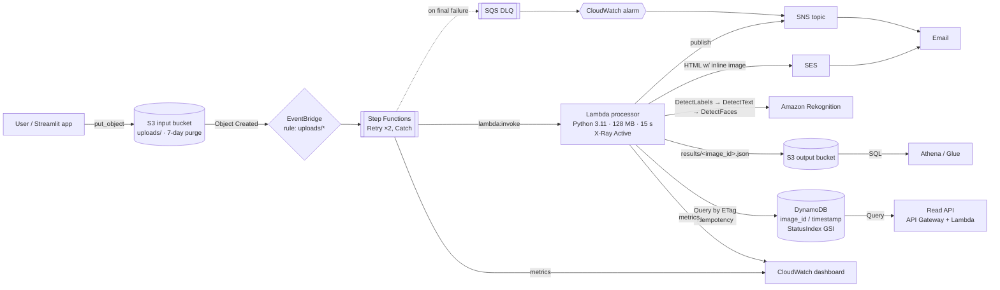
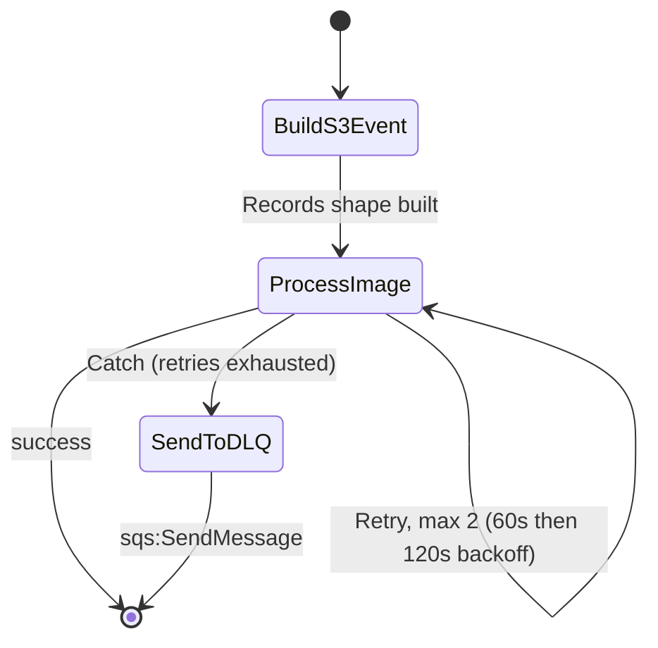
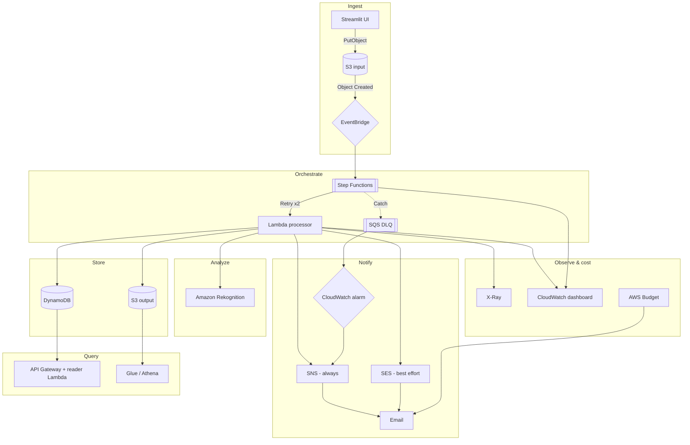

# CloudSight Intake

A production-shaped, serverless image-triage pipeline on AWS, built as a small
(~10-user) community health-screening tool, that stays inside the **AWS
Always-Free tier** in its default configuration.

Cognito login (Patient / Power User / Owner roles) → upload → S3 event →
EventBridge → Step Functions → Lambda (X-Ray traced) → cascading Amazon
Rekognition → **classified** as `medical` / `non_human` / `needs_review` →
summary in DynamoDB + full JSON in S3. Only the `medical` branch notifies a
doctor (SES/SNS); the others are in-app only. A Power User review queue and an
Owner user-management screen round out the app. Failures retry and then land
in an SQS dead-letter queue via the state machine's Catch, with a CloudWatch
alarm, and a CloudWatch dashboard tracks the whole thing. A monthly AWS Budget
emails you if it ever stops being free.

**Just want to use the app?** See the [User Guide](docs/user-guide.md) — the
UI link, login, photo guidelines, role-by-role instructions, and how to read
your results.

> **Not cleared for public/general use.** This is reviewed and hardened for a
> small, known set of trusted users, not the general public — see
> [Security & readiness](#security--readiness) below before considering wider
> deployment.

---

## Architecture



### Request flow

1. The client writes `uploads/<name>` to the **input bucket**.
2. S3 sends an **Object Created** event to the account's **EventBridge** bus;
   a rule filtered to the `uploads/` prefix starts a **Step Functions**
   execution (decoupled — events are on the bus, not a direct S3→Lambda wire).
3. The state machine builds the `{"Records": [...]}` shape the Lambda expects,
   then invokes it as a `Task` with **`Retry`** (2 attempts, backoff) and a
   **`Catch`** that forwards to the **SQS DLQ** on final failure — replacing
   Lambda's built-in async-retry/DLQ with an explicit, visualisable execution
   graph per upload (Step Functions console).
4. Lambda takes the S3 object **ETag as `image_id`** and `Query`s DynamoDB — if a
   row already exists the event is a duplicate and is skipped (idempotency).
5. If `USE_REKOGNITION=true`, it calls `detect_labels`, then `detect_text` (only
   if labels came back), then `detect_faces` (only if labels or text came back).
   Otherwise it records a `metadata-only` result. This gating caps Rekognition
   calls at 3 per image and usually fewer.
6. It writes a summary row to **DynamoDB** and the full result to
   `results/<image_id>.json` in the **output bucket**.
7. It sends **SNS** (always, guaranteed delivery) and attempts an **SES** HTML
   email with the image embedded inline (best-effort — can be spam-filtered by
   strict-DMARC recipient domains even when SES itself accepts it).
8. Every call is captured as an **X-Ray** trace (segments for S3, DynamoDB, SNS,
   Rekognition via `patch_all()`).
9. Anyone can query results after the fact via the **read-only HTTP API**
   (`GET /images`, `GET /images/{image_id}`) or **Athena SQL** over the JSON in
   the output bucket — no Lambda changes needed for either.

### Step Functions execution

What actually happens inside the `Task` state on a failure — proven live
against the deployed stack, not just configured (see
[Troubleshooting](#troubleshooting)):



Every execution — success or failure — gets its own visual graph and timing in
the [Step Functions console](https://console.aws.amazon.com/states/home)
(`terraform -chdir=terraform output state_machine_console_url`); a failed one
shows the exact retry/backoff/catch path taken, and the DLQ message it produces
carries the original event **plus the full exception trace**.

### AWS resource map

Everything the stack provisions, grouped by role:



---

## Security & readiness

Hardened and reviewed for **a small, known set of trusted users** (patients,
health workers, and an admin you've personally onboarded) — **not** for the
general public. In place: Cognito auth with role-based access (patient /
power user / owner), least-privilege IAM throughout (documented exceptions
where the AWS API itself has no resource-level scoping), encryption at rest
and TLS-only bucket policies, DynamoDB point-in-time recovery, a read API
locked to AWS_IAM auth, DLQ + CloudWatch alarms, and a static-analysis pass
(Checkov/TFLint) triaged rather than rubber-stamped.

Deliberately **not** production/public-ready:

- **No BAA, HIPAA/equivalent compliance program, Terms of Service, Privacy
  Policy, or documented user consent flow.** If this handles real health
  photos of real people, that's a legal/compliance decision for you (and
  likely counsel), not something this codebase can certify on its own.
- **Rekognition label detection is a screening aid, not a diagnosis** or a
  regulated medical device. Treat every automated route as advisory.
- **Cognito is admin-create-only (no public sign-up), SES is in sandbox
  mode** (can only email verified addresses), and this AWS account's Lambda
  concurrency is capped at 10 — none of that supports open public traffic
  without further work.
- No WAF, no CAPTCHA/bot protection, no self-service signup, no third-party
  security audit or penetration test.

Bottom line: safe for the pilot scope it was built for; a genuine go/no-go
decision (legal, clinical, and technical) before handing it to strangers.

---

## Repository layout

```
terraform/        IaC — split into main.tf / variables.tf / outputs.tf / backend.tf
lambda/           index.py (handler) + requirements.txt (xray sdk only)
app/              Streamlit front end
scripts/          build_lambda.sh — the single Lambda packager (TF + CI both call it)
tests/            pytest + moto unit tests for the handler
.github/workflows deploy.yml (lint→test→apply) · destroy.yml
```

---

## Free-tier cost breakdown

Default config = `use_rekognition = false`. At demo volumes the bill is **$0.00**.

| Service | This stack uses | Free allowance | Notes |
|---|---|---|---|
| Lambda | 128 MB, ≤15 s, a few invokes | 1M requests + 400,000 GB-s / month | **Always free** |
| DynamoDB | On-demand, tiny items | 25 GB storage | **Always free**; on-demand R/W here is fractions of a cent |
| SQS | 1 DLQ, near-zero traffic | 1M requests / month | **Always free** |
| SNS | Email notifications | 1,000 email notifications / month | **Always free** |
| CloudWatch | 1 dashboard, 1 alarm, Lambda logs | 3 dashboards, 10 alarms, 5 GB logs | **Always free** |
| X-Ray | Traces from each invoke | 100,000 traces recorded / month | **Always free** |
| S3 | 2 buckets, small objects, 7-day input purge | 5 GB, 20k GET, 2k PUT | **12 months only**, then ~$0.023/GB-mo |
| Rekognition | On by default in the pipeline (12-mo window accepted) | 5,000 images / month | **12 months only**, then ~$1/1,000 images |
| SES | Rich email on each processed image | 3,000 sends / month | **12 months only**, then ~$0.10/1,000 |
| Step Functions | 1 Standard execution per image | 4,000 state transitions / month | **Always free** (this uses 3 transitions/image) |
| EventBridge | 1 rule, default bus | 1M events / month (custom bus tier; default bus is free) | **Always free** |
| API Gateway (HTTP API) | Read endpoint, throttled 5 rps | 1M requests / month | **12 months only**, then ~$1/million |
| Glue / Athena | 1 table (no crawler), ad-hoc queries | Glue: 1M objects free; Athena: $5/TB scanned, capped 1 GB/query | Effectively **$0** at this data size |
| Budgets | 1 cost budget, 2 email alerts | 2 free budgets / account | **Always free** |

Cost guardrails built in: input bucket purges `uploads/` after 7 days, logs
retain 7 days, DynamoDB is `PAY_PER_REQUEST`, Rekognition calls are gated,
Athena queries are capped at 1 GB scanned, the read API is throttled, and an
AWS Budget emails you at 80% actual / 100% forecasted spend.

---

## Prerequisites

- Python 3.11 and (for local runs) Terraform ≥ 1.10, AWS CLI with credentials
  that can create the resources above.
- An email address for SNS — **you must click the confirmation link** or no
  notifications are delivered (see [Troubleshooting](#troubleshooting)).

## Deploy via GitHub Actions (recommended)

The `deploy` job creates the Terraform state bucket itself, so no local terminal
is needed.

1. Repo → **Settings → Secrets and variables → Actions → Secrets**:

   | Secret | Value |
   |---|---|
   | `AWS_ACCESS_KEY_ID` / `AWS_SECRET_ACCESS_KEY` | deploy IAM user (needs `s3:CreateBucket`, `s3:PutBucketVersioning`, `s3:PutBucketPublicAccessBlock` on top of the pipeline resources; `AdministratorAccess` is fine for a solo account) |
   | `TF_STATE_BUCKET` | any globally-unique name, e.g. `cloudsight-tfstate-<account-id>` |
   | `SNS_EMAIL` | notification address |
   | `AWS_REGION` | optional; defaults to `us-east-1` (may be a Variable instead) |

2. Push to `main`. Watch the run: `test` → `deploy`.
3. Open the run's **Summary** — it prints the `INPUT_BUCKET` / `OUTPUT_BUCKET` /
   `DYNAMODB_TABLE` names to paste into the Streamlit app's Secrets.
4. **Confirm the SNS email** that AWS sends to `SNS_EMAIL`.

## Deploy locally

```bash
git clone <your-repo-url> cloudsight-intake && cd cloudsight-intake

# 1. One-time remote-state bucket
ACCOUNT=$(aws sts get-caller-identity --query Account --output text)
aws s3api create-bucket --bucket cloudsight-tfstate-$ACCOUNT --region us-east-1
aws s3api put-bucket-versioning --bucket cloudsight-tfstate-$ACCOUNT \
  --versioning-configuration Status=Enabled

# 2. Config
cd terraform
cp backend.hcl.example backend.hcl              # set bucket = cloudsight-tfstate-<ACCOUNT>, region
cp terraform.tfvars.example terraform.tfvars    # set sns_email
cd ..

# 3. Deploy
bash scripts/build_lambda.sh
terraform -chdir=terraform init -backend-config=backend.hcl
terraform -chdir=terraform apply
```

Then confirm the SNS email and run the [functional test](#functional-testing).

> For a throwaway run with no remote state, delete `terraform/backend.tf` and
> `terraform init` with local state.

## Functional testing

End-to-end check — upload an image, wait for the DynamoDB row + result JSON, tail
the logs, and verify the email subscription:

```bash
./scripts/smoke-test.sh                       # uses test/sample-image.jpg
./scripts/smoke-test.sh path/to/your.jpg
```

`PASS` means S3 → Lambda → DynamoDB → results JSON all worked. The script warns
loudly if the SNS subscription is still `PendingConfirmation` (the usual reason
no email arrives). Manual equivalent:

```bash
BUCKET=$(terraform -chdir=terraform output -raw input_bucket)
aws s3 cp test/sample-image.jpg s3://$BUCKET/uploads/sample-image.jpg
aws logs tail /aws/lambda/cloudsight-intake-processor --follow
aws dynamodb scan --table-name "$(terraform -chdir=terraform output -raw dynamodb_table)" \
  --query 'Items[].{id:image_id.S,status:status.S,summary:summary.S}' --output table
```

## Troubleshooting

**No email when an image is processed** — in order of likelihood:

1. **Subscription not confirmed.** `aws_sns_topic_subscription` starts as
   `PendingConfirmation`; AWS emails an *"AWS Notification - Subscription
   Confirmation"* link that must be clicked before *any* message is delivered.
   Check:
   ```bash
   aws sns list-subscriptions-by-topic \
     --topic-arn "$(terraform -chdir=terraform output -raw sns_topic_arn)" \
     --query 'Subscriptions[].{Endpoint:Endpoint,Arn:SubscriptionArn}'
   ```
   If the ARN is literally `PendingConfirmation`, re-send it:
   ```bash
   aws sns subscribe --topic-arn "$(terraform -chdir=terraform output -raw sns_topic_arn)" \
     --protocol email --notification-endpoint you@example.com
   ```
   then click the link. Check spam/promotions too.
2. **The pipeline never ran.** If `terraform apply` hasn't succeeded, the input
   bucket doesn't exist and uploads go nowhere. Run the functional test — a
   `FAIL` with no DynamoDB row points here. Check
   `aws logs tail /aws/lambda/cloudsight-intake-processor --since 15m`.
3. **Lambda error before publish.** The handler still tries to send a *failure*
   email and then re-raises to the DLQ. Check the DLQ:
   `aws sqs get-queue-attributes --queue-url "$(terraform -chdir=terraform output -raw dlq_url)" --attribute-names ApproximateNumberOfMessagesVisible`.
4. **Wrong email in `sns_email`.** Fix `terraform.tfvars` (or the `SNS_EMAIL`
   secret), re-apply, confirm the new subscription.

**Streamlit `NoSuchBucket` / `InvalidAccessKeyId`** — the app's Secrets point at
buckets that don't exist yet, or the IAM keys are wrong/for another account.
Deploy the backend first, then paste the exact names from the Actions run Summary
(or `terraform output`) into the Streamlit Secrets panel and reboot the app.

**`terraform init` → "The value cannot be empty or all whitespace"** — the
`TF_STATE_BUCKET` (or `AWS_REGION`) secret is unset, so `-backend-config="bucket="`
was passed empty. Set the secret.

## Run the Streamlit app locally

```bash
python3 -m venv .venv && source .venv/bin/activate
pip install -r app/requirements.txt
make app        # exports the terraform outputs and runs streamlit
```

## Enable Rekognition

```hcl
# terraform.tfvars
use_rekognition = true
```
`make deploy` again. Stays free for the first 12 months / 5,000 images per month.

---

## Viewing live X-Ray traces

The Lambda has `tracing_config { mode = "Active" }` and the handler calls
`aws_xray_sdk.core.patch_all()`, so S3 / DynamoDB / SNS / Rekognition calls show
as subsegments.

1. `terraform -chdir=terraform output xray_service_map_url` — open it. After an
   upload you'll see `AWS::Lambda` fanning out to DynamoDB, S3, SNS (and
   Rekognition when enabled), with latency and error rates on each edge.
2. `terraform -chdir=terraform output xray_traces_url` — the trace list. Click a
   trace for the waterfall timeline of one image.
3. CLI:
   ```bash
   aws xray get-trace-summaries \
     --start-time $(date -u -d '-15 min' +%s) --end-time $(date -u +%s) \
     --query 'TraceSummaries[].Id'
   ```
4. Disable locally / in tests with `AWS_XRAY_SDK_ENABLED=false` (CI sets this).

The CloudWatch dashboard (`terraform -chdir=terraform output dashboard_url`) shows
Lambda invocations/errors/throttles, duration avg + p99, DynamoDB consumed
capacity, Step Functions executions succeeded/failed, and DLQ backlog. The
**Step Functions console** (`terraform -chdir=terraform output
state_machine_console_url`) shows a visual graph of every execution — which
state it was in, how long each took, and the Retry/Catch path taken on failure.

## Querying results after the fact

**Read API** (AWS_IAM/SigV4 auth required, throttled 5 req/s — the results
include patient-identifying data, so this is no longer an open endpoint; a
plain `curl` gets a 403). Use `awscurl` (`pip install awscurl`) with your own
AWS credentials:

```bash
BASE=$(terraform -chdir=terraform output -raw api_base_url)
awscurl --service execute-api --region us-east-1 "$BASE/images?status=processed&limit=10"
awscurl --service execute-api --region us-east-1 "$BASE/images/<image_id>"
```

The calling principal needs `execute-api:Invoke` on this API's ARN - not
granted to anyone by default; add it explicitly to whichever IAM principal
should be able to call it.

**Athena SQL** over every result JSON, no crawler (fixed schema):

```bash
aws athena start-query-execution \
  --work-group "$(terraform -chdir=terraform output -raw athena_workgroup)" \
  --query-string "
    SELECT image_key, summary, label_count,
           cardinality(labels) AS n_labels
    FROM \"$(terraform -chdir=terraform output -raw glue_database)\".results
    WHERE status = 'processed'
    ORDER BY \"timestamp\" DESC
    LIMIT 20
  "
# then: aws athena get-query-results --query-execution-id <id from above>
```

Or run the same query in the Athena console against that workgroup/database —
capped at 1 GB scanned per query, so a runaway query costs cents at worst.

---

## Development

```bash
pip install -r lambda/requirements.txt -r requirements-dev.txt
make lint      # ruff
make test      # pytest + moto (handler: metadata path, idempotency, skips, head_object fallback)
make fmt       # terraform fmt
```

CI (`.github/workflows/deploy.yml`): **test** job runs ruff + pytest + `terraform
fmt/validate` on every push and PR; **deploy** job runs `terraform apply` on push
to `main`.

Required repo **Secrets**: `AWS_ACCESS_KEY_ID`, `AWS_SECRET_ACCESS_KEY`,
`AWS_REGION`, `SNS_EMAIL`. Optional repo **Variable**: `USE_REKOGNITION`.
Commit `terraform/backend.hcl` is git-ignored — either commit a non-secret copy
or add a CI step to render it from secrets.

## Teardown

```bash
BUCKET=$(terraform -chdir=terraform output -raw input_bucket)
OUT=$(terraform -chdir=terraform output -raw output_bucket)
aws s3 rm s3://$BUCKET --recursive ; aws s3 rm s3://$OUT --recursive
make destroy
```

---

# Push to GitHub & deploy the Streamlit app for a live public URL

### 1. Push this repo to GitHub

```bash
# from the repo root
git add -A
git commit -m "CloudSight Intake: serverless image pipeline"

# create the remote (GitHub CLI)
gh repo create cloudsight-intake --public --source=. --remote=origin --push
# …or, without gh: make an empty repo on github.com, then:
#   git remote add origin https://github.com/<you>/cloudsight-intake.git
#   git branch -M main
#   git push -u origin main
```

Confirm `.gitignore` did its job — none of these should be staged:
`terraform/backend.hcl`, `terraform/terraform.tfvars`, `terraform/*.tfstate*`,
`.streamlit/secrets.toml`, `terraform/build/`, `terraform/dist/`.

### 2. Deploy the AWS backend once (so the app has something to talk to)

Follow **Quickstart** above (or push to `main` with the four repo Secrets set and
let the `deploy` workflow run). Note the outputs:

```bash
terraform -chdir=terraform output   # input_bucket, output_bucket, dynamodb_table
```

### 3. Create a scoped IAM user for the app

The Streamlit app only needs to put objects, query one table, and get results:

```bash
aws iam create-user --user-name cloudsight-streamlit
aws iam put-user-policy --user-name cloudsight-streamlit \
  --policy-name cloudsight-streamlit \
  --policy-document '{
    "Version":"2012-10-17",
    "Statement":[
      {"Effect":"Allow","Action":"s3:PutObject","Resource":"arn:aws:s3:::cloudsight-intake-input-<ACCOUNT>/uploads/*"},
      {"Effect":"Allow","Action":"s3:GetObject","Resource":"arn:aws:s3:::cloudsight-intake-output-<ACCOUNT>/results/*"},
      {"Effect":"Allow","Action":["dynamodb:Query"],"Resource":"arn:aws:dynamodb:*:<ACCOUNT>:table/cloudsight-intake-results"}
    ]}'
aws iam create-access-key --user-name cloudsight-streamlit
```

### 4. Deploy to Streamlit Community Cloud

1. Go to <https://share.streamlit.io> and sign in with GitHub. Authorize access
   to the `cloudsight-intake` repo.
2. **Create app → Deploy a public app from GitHub**:
   - Repository: `<you>/cloudsight-intake`
   - Branch: `main`
   - **Main file path: `app/app.py`**
3. Open **Advanced settings → Python version → 3.11**.
   (Streamlit Cloud installs `app/requirements.txt` automatically.)
4. Paste into **Secrets** (TOML — see `.streamlit/secrets.toml.example`):
   ```toml
   AWS_REGION            = "us-east-1"
   AWS_ACCESS_KEY_ID     = "<from step 3>"
   AWS_SECRET_ACCESS_KEY = "<from step 3>"
   INPUT_BUCKET   = "cloudsight-intake-input-<ACCOUNT>"
   OUTPUT_BUCKET  = "cloudsight-intake-output-<ACCOUNT>"
   DYNAMODB_TABLE = "cloudsight-intake-results"
   ```
5. **Deploy**. You get a public URL — this project's is
   <https://image-processing-pipeline-devops.streamlit.app/> — share it for
   testing. Every push to `main` redeploys it automatically.

> Keep `use_rekognition = false` for a public demo so anonymous uploads can't run
> up Rekognition usage. The 7-day input-bucket purge cleans up whatever visitors
> upload.
