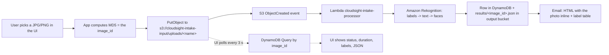
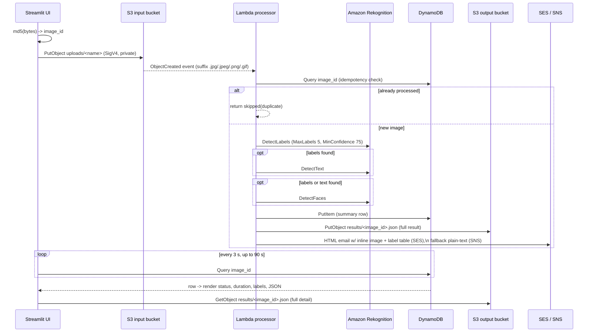

# Wildlife Identification Guide

CloudSight Intake turns a photo you upload into an **animal identification result**:
category labels (e.g. `Deer`, `Bird`, `Wildlife`, `Mammal`), confidence scores, any
readable text (tags, collars, signage), and the raw JSON — all delivered by email
and stored in the cloud.

> **What it can and can't do.** The identification engine is **Amazon Rekognition
> label detection** — a general-purpose visual classifier. It reliably names the
> *kind* of animal and prominent attributes (`Antelope`, `Horned`, `Wildlife`,
> `Grassland`). It does **not** do species-level taxonomy — it will say `Deer`,
> not `Odocoileus virginianus`. Good field technique (below) is what moves a
> result from `Animal 88%` to `Deer 99%, Wildlife 99%, Antler 74%`.

---

## 1. Access point

### UI link

**<https://image-processing-pipeline-devops.streamlit.app/>**

The uploader is a Streamlit app deployed on **Streamlit Community Cloud**, on
the auto-generated subdomain for this repo (`<repo>-<owner>.streamlit.app`).

To find it again yourself, or if you redeploy under a different name:

1. Go to <https://share.streamlit.io> and sign in with GitHub.
2. Open the **image-processing-pipeline** app → the URL is shown at the top, or
   use the **⋮ → Copy app URL** menu.

Deployment configuration (Streamlit Cloud → *Create app*):

| Field | Value |
|---|---|
| Repository | `devopsdesign/image-processing-pipeline` |
| Branch | `main` |
| **Main file path** | `app/app.py` |
| Python version | `3.11` (Advanced settings) |

App **Secrets** (Settings → Secrets), pointing the UI at the deployed backend:

```toml
AWS_REGION            = "us-east-1"
AWS_ACCESS_KEY_ID     = "<scoped uploader key>"
AWS_SECRET_ACCESS_KEY = "<scoped uploader secret>"

INPUT_BUCKET   = "cloudsight-intake-input-920534282171"
OUTPUT_BUCKET  = "cloudsight-intake-output-920534282171"
DYNAMODB_TABLE = "cloudsight-intake-results"
```

The scoped IAM user needs only `s3:PutObject` on `…-input-*/uploads/*`,
`s3:GetObject` on `…-output-*/results/*`, and `dynamodb:Query` on the results
table — never reuse the deploy credentials.

### How an upload triggers the pipeline



The browser never talks to Rekognition or Lambda directly. It does exactly two
things: **write the object to S3**, and **poll DynamoDB** for the row keyed by the
image's MD5 hash (which the Lambda uses as `image_id`). Everything between is
event-driven and serverless — putting the object in the `uploads/` prefix *is*
the trigger.

---

## 2. Field guide — taking photos that identify well

The classifier scores what it can see. These practices raise both the top label's
confidence and the number of useful secondary labels.

### Framing

- **Fill 50–80% of the frame with the animal.** Too far away → `Wildlife 70%`
  and nothing else. Too close / cropped → body parts only (`Fur`, `Snout`).
- **Whole body in one shot** when possible — silhouette, leg length, tail, and
  body-to-head ratio are strong category cues.
- **Get the head and, if present, horns/antlers/ears in frame.** These drive the
  most specific labels (`Antler`, `Horned`, `Elephant`, `Deer`).
- **Shoot at the animal's eye level**, not down from a trail or vehicle — a
  top-down angle flattens the shape the classifier relies on.
- **One subject per photo.** A herd returns `Herd`, `Group`; a single clear
  individual returns the animal.

### Lighting & exposure

- **Soft, even light** (overcast, or the golden hour) beats harsh midday sun.
- **Keep the sun behind you**, lighting the animal's flank — backlit animals
  become dark shapes and score as `Silhouette`.
- **Expose for the animal, not the sky.** Tap the animal on your phone screen
  before shooting. Blown-out or crushed-black subjects lose all texture labels.
- **Avoid heavy zoom in low light** — noise and blur collapse confidence. Move
  closer if it's safe; otherwise accept a smaller subject in a sharp frame.

### Sharpness

- **Focus on the eye/head.** A sharp head with a soft body still identifies; the
  reverse usually doesn't.
- **Brace or rest the camera**; use a fast shutter (1/1000 s+ for moving animals).
- Prefer **one sharp frame over ten soft ones** — burst, then upload only the
  crispest.

### Diagnostic (indirect) sign — when you can't photograph the animal

The engine reads these as generic scene/label evidence, and they're invaluable
context for a human reviewing the JSON:

- **Tracks:** place a coin, lens cap, or ruler beside the print for scale. Shoot
  straight down, in raking side-light so the ridges cast shadow. Capture a
  **trail** (several prints) as well as one clean print — stride and gait matter.
- **Scat:** photo with scale object, note substrate; frame the whole dropping and
  any contents.
- **Feeding sign, rubs, wallows, nests, burrows:** include a scale reference and
  one wide shot for context plus one close-up.
- **Markings & pelage:** get a square-on shot of flank patterning, facial mask,
  rump patch, or stripe/spot layout — these are the features a reviewer uses to
  take `Deer` down to a species.

### Multiple angles

Upload a **small set** (2–4 images) of the same animal when you can:

1. Whole body, side-on.
2. Head / face close-up.
3. Any distinctive feature (tail, feet, horns, markings).
4. The habitat / wide context.

Each file is processed independently and produces its own result; compare the
label sets to converge on an ID.

### Handling unclear results

| Result | Likely cause | Fix |
|---|---|---|
| `Animal`, `Wildlife`, `Mammal` only, ~70–85% | subject too small, soft, or backlit | move closer, expose for the animal, refocus on the head |
| `Silhouette`, `Shadow` | backlit | reposition so light falls on the flank |
| body-part labels (`Fur`, `Snout`, `Wing`) | framed too tight | step back, include the whole animal |
| `no analysis data` / `metadata-only` | Rekognition is disabled on the stack | redeploy with `use_rekognition = true` |
| plausible but low confidence | genuine ambiguity | upload extra angles; use the diagnostic-sign shots; hand the JSON to a field expert |
| wrong label with high confidence | mimic pose, unusual angle, occlusion | reshoot from eye level, whole body, clean background |

**Rule of thumb:** treat anything **below ~90%** as a *suggestion*, and never rely
on a single frame for a decision that matters (relocation, conflict response,
research records). The JSON keeps every label with its score so a person can
audit the call.

### Ethics & safety

- Keep a distance that doesn't change the animal's behaviour. Use zoom/crop, not
  approach. Never bait, corner, or flush wildlife for a photo.
- Give nests, dens, and young a wide berth.
- Don't publish precise geotags for rare or persecuted species.
- Your safety first — no photo is worth approaching a large or defensive animal.

---

## 3. Technical flow — what happens on upload

### Sequence



### Step by step

1. **Client-side hash.** The UI reads the file bytes and computes `MD5`, which
   equals the S3 single-part upload ETag. This value is the `image_id` and the
   correlation key between the browser and the backend — no ID is passed around.

2. **Upload.** `PutObject` to
   `s3://cloudsight-intake-input-<acct>/uploads/<filename>`. The bucket has
   Block-Public-Access on and SSE-S3 (AES256); the request is authenticated
   SigV4 with the scoped uploader key.

3. **Event trigger.** S3 emits an `s3:ObjectCreated:*` event, filtered to the
   `uploads/` prefix and `.jpg/.jpeg/.png/.gif` suffixes, which asynchronously
   invokes **`cloudsight-intake-processor`** (Python 3.11, 128 MB, 15 s timeout,
   X-Ray active). Async invocation config: 2 retries, then the
   **`cloudsight-intake-dlq`** SQS dead-letter queue (a CloudWatch alarm fires if
   anything lands there).

4. **Idempotency.** The Lambda `Query`s DynamoDB for `image_id`. If a row exists,
   it returns `skipped / duplicate` — re-uploading the same photo never
   double-processes or double-emails.

5. **Identification (cascading, to conserve calls).**
   - **`DetectLabels`** — `MaxLabels=5`, `MinConfidence=75`. Returns the animal
     category and scene/attribute labels with confidence.
   - **`DetectText`** — only if labels came back. Reads collars, ear tags, band
     numbers, trail-cam stamps, signage.
   - **`DetectFaces`** — only if labels or text came back. Near-always empty for
     wildlife; kept for completeness / mixed uploads.
   - `USE_REKOGNITION=false` skips all three (`metadata-only` mode) — the
     always-free configuration; results then carry no labels.

6. **Persist.**
   - **DynamoDB** `cloudsight-intake-results` (`image_id` HASH, `timestamp`
     RANGE, `StatusIndex` GSI, on-demand): one summary row —
     `status`, `analysis_mode`, `label_count`, `text_count`, `face_count`,
     `rekognition_calls`, `summary`.
   - **S3** `s3://cloudsight-intake-output-<acct>/results/<image_id>.json`: the
     full result including every label with its confidence, detected text, and
     face blocks.

7. **Notify.**
   - **SES** — HTML email to the verified address with the uploaded photo
     embedded inline (Content-ID) plus a labels table and the presigned
     full-size link.
   - **SNS** — plain-text fallback to the topic subscription when SES is
     unverified or the message exceeds limits; also carries deploy/teardown
     status.

8. **Return to the UI.** The browser has been polling DynamoDB by `image_id`
   every 3 s (≤ 90 s). On the first hit it renders the status badge, wall-clock
   processing duration, the label metrics, and then fetches
   `results/<image_id>.json` for the full breakdown.

### Result shape

```json
{
  "image_id": "20b74245d514163b48598877352496a6",
  "timestamp": "2026-09-10T01:09:17.636565+00:00",
  "image_key": "uploads/elk-side-on.jpg",
  "status": "processed",
  "analysis_mode": "rekognition",
  "label_count": 5,
  "text_count": 0,
  "face_count": 0,
  "rekognition_calls": 3,
  "summary": "5 labels",
  "labels": [
    { "name": "Deer",     "confidence": 99.1 },
    { "name": "Wildlife",  "confidence": 99.1 },
    { "name": "Elk",       "confidence": 92.4 },
    { "name": "Antler",    "confidence": 78.0 },
    { "name": "Mammal",    "confidence": 99.1 }
  ],
  "text": [],
  "faces": []
}
```

### Failure handling

| Failure | Behaviour |
|---|---|
| Unsupported file type | `skipped / unsupported_type`, no charge |
| Rekognition call errors | logged, that sub-result is empty, `analysis_mode` degrades to `rekognition-fallback` / `partial_error`; the row and JSON are still written |
| SES not verified / oversize | automatic fallback to SNS plain-text email |
| Any unhandled exception | error email sent, exception re-raised → 2 retries → SQS DLQ + CloudWatch alarm |
| UI poll timeout (90 s) | UI shows "still processing" with a CloudWatch Logs hint; the pipeline continues regardless |

### Observability

- **CloudWatch dashboard** `cloudsight-intake-dashboard` — Lambda invocations /
  errors / duration (avg + p99), DynamoDB consumed capacity, DLQ backlog.
- **X-Ray** — per-upload trace with sub-segments for S3, DynamoDB, SNS/SES and
  each Rekognition call; service map shows latency and error rate per hop.
- **Logs** — `/aws/lambda/cloudsight-intake-processor`, 7-day retention.

### Cost posture

Always-free: Lambda, DynamoDB on-demand, SNS, SQS, CloudWatch (1 dashboard / 1
alarm), X-Ray, presigned URLs. 12-month free tier: S3 storage (tiny), Amazon
Rekognition (5,000 images/month), SES (send). Beyond the window, Rekognition is
~$1 per 1,000 images and SES ~$0.10 per 1,000 emails. Run the **Destroy**
workflow to return to $0.
